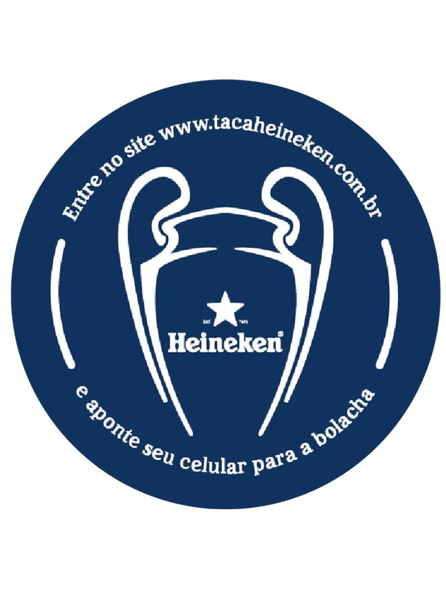
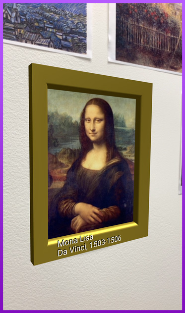
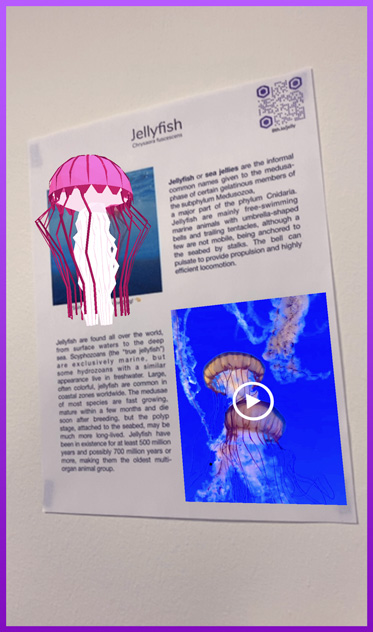
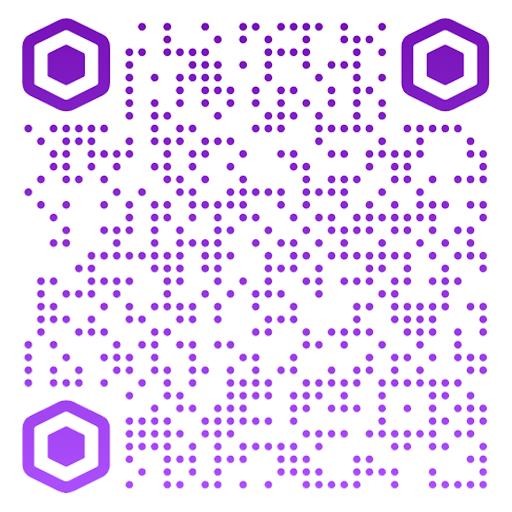
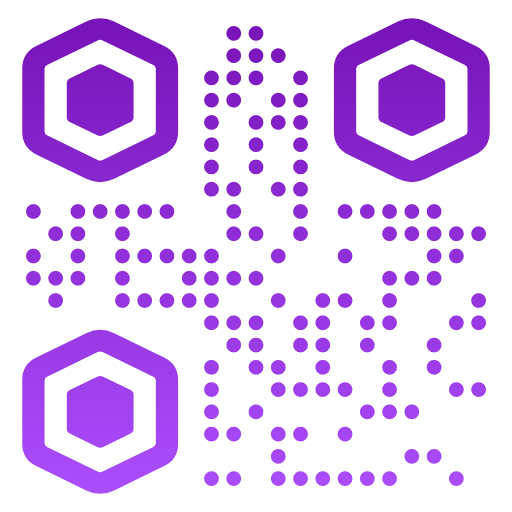
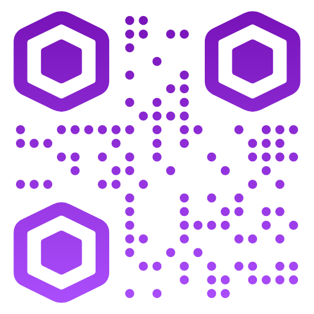

# 8th Wall Web Examples

Example 8th Wall Web projects, by 3D framework

### Marker Based

* [heineken](https://github.com/EdwardFornieles/web/tree/master/examples/aframe/heineken) - heineken AR

* [Art gallery](https://github.com/EdwardFornieles/web/tree/master/examples/aframe/artgallery) - This example uses image targets to show information about paintings in AR. This showcases image target tracking, as well as loading dynamic content and using the xrextras-generate-image-targets component.
* [Flyer](https://github.com/EdwardFornieles/web/tree/master/examples/aframe/flyer) - This example uses image targets to display information about jellyfish on a flyer. It uses the xrextras-named-image-target component to connect an <a-entity> to an image target by name while the xrextras-play-video component enables video playback. 

| heineken | Art gallery | Flyer
| :----------: | :----------: | :----------: |
|  |  | 
| [Image targets for demo](./examples/aframe/heineken/heineken.jpg) | [Image targets for demo](./examples/aframe/artgallery/gallery.jpg) | [Image targets for demo](./examples/aframe/flyer/flyer.jpg)
| [Try Demo (mobile)](https://edwardfornieles.github.io/web/examples/aframe/heineken/index.html) | [Try Demo (mobile)](https://apps.8thwall.com/8thWall/aframe_artgallery) | [Try Demo (mobile)](https://apps.8thwall.com/8thWall/aframe_flyer)
| or scan on phone:   | or scan on phone:   | or scan on phone:  